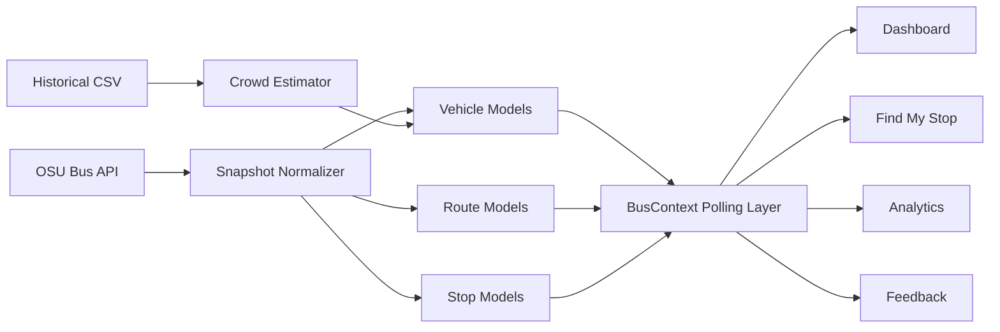
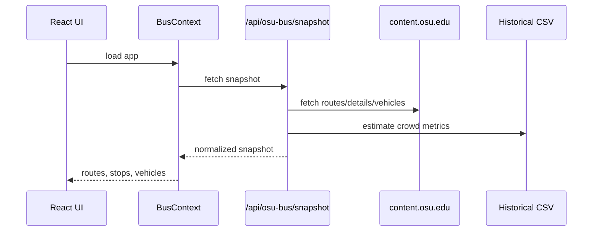

# Maple Flow Bus Tracker

<p align="center">
  
</p>

<p align="center">
  <strong>Live OSU bus arrivals, stop locations, and route geometry with estimated crowd intelligence.</strong>
</p>

Maple Flow is a React-based Ohio State bus dashboard that combines live OSU transit data with estimated crowding overlays. The project started as a simulation-driven bus tracker and was upgraded to use the real OSU bus feed for routes, stops, vehicles, and arrival predictions while keeping crowd and comfort metrics as explicitly estimated values.

## At a Glance

| Live Transit Data | Estimated Rider Signals | Deployment Ready |
| --- | --- | --- |
| OSU routes, stops, vehicles, ETAs | crowd level, occupancy, comfort | local Express + Vercel API |

## Visual Overview



## What This Project Does

- shows live OSU bus routes, stops, and vehicle positions
- renders real stop-level arrival predictions from the OSU bus API
- draws route geometry from decoded OSU polyline data
- provides stop-focused arrival views in `Find My Stop`
- keeps crowding, occupancy, and comfort visible as estimates rather than pretending they are live
- allows rider feedback to locally override estimated crowd levels
- includes analytics pages built from the live snapshot plus estimated occupancy data

## What We Changed

This project is no longer driven by the old CSV playback simulation.

We replaced the original simulation pipeline with:

- a live OSU snapshot service that fetches route metadata, route details, and per-route vehicles
- normalized route, stop, and vehicle models built around `routeCode`, stop ids, and prediction-based ETAs
- a polling-based frontend data layer in `BusContext`
- a same-repo backend for local development and production hosting
- a Vercel-compatible serverless endpoint so `/api/osu-bus/snapshot` works after deployment

At the same time, we preserved the product’s crowd-intelligence layer by estimating occupancy from the historical CSV dataset when real occupancy data is not available from OSU.

## Live Data vs Estimated Data

### Live from OSU

- route list
- route colors
- route polylines
- stop names and coordinates
- vehicle positions
- vehicle heading and speed
- stop-level arrival predictions

### Estimated in Maple Flow

- crowd level
- passenger count
- occupancy percentage
- comfort score

These estimates are derived from the historical CSV dataset where route coverage exists. For routes without historical coverage, the app falls back to neutral estimated values.

## Architecture

### Frontend

The frontend is a Create React App application with the main user-facing pages:

- `Dashboard`: live map, active buses, refresh state, estimated crowd badges
- `Find My Stop`: live arrivals for a selected stop, keyed by real stop ids
- `Analytics`: live arrival distributions and route-level estimated occupancy summaries
- `Feedback`: user-reported crowd overrides for the current session/local storage

### Backend

The backend exposes a single normalized endpoint:

- `GET /api/osu-bus/snapshot`

This snapshot endpoint:

- fetches `https://content.osu.edu/v2/bus/routes`
- fetches `/:routeCode` for stops and patterns
- fetches `/:routeCode/vehicles` for live bus predictions
- merges everything into frontend-ready `routes`, `stops`, and `vehicles`
- caches the last good snapshot for 15 seconds
- serves stale cached data if the upstream OSU API temporarily fails

### Data Flow

1. The backend fetches and normalizes OSU route data.
2. The backend augments live vehicles with estimated crowd metrics.
3. The frontend polls the snapshot every 20 seconds.
4. `BusContext` decorates the snapshot with local favorites and user crowd overrides.
5. Components render from the normalized model instead of inferring state from simulation objects.



## Key Implementation Notes

- Route geometry is drawn from decoded polyline data instead of straight stop-to-stop lines.
- Stop matching is based on real stop ids, not fuzzy name matching.
- Vehicles without a confirmed `lastStop` are shown as en route to the next predicted stop.
- The frontend keeps favorite stops and user-reported crowd overrides in local storage.
- The API base URL automatically uses `http://localhost:3001` in local CRA development and relative `/api/...` paths in production deployments.

## Local Development

Install dependencies:

```bash
npm install
```

Run the React app and the local proxy together:

```bash
npm start
```

Local URLs:

- frontend: `http://localhost:3000`
- local proxy: `http://localhost:3001`

## Production Build

Create the frontend build:

```bash
npm run build
```

Serve the production build with the Express proxy:

```bash
npm run serve
```

## Deploying to Vercel

This repo now supports Vercel deployment.

Relevant files:

- `api/osu-bus/snapshot.js`
- `vercel.json`

On Vercel:

- the React app is served from the built `build/` directory
- `/api/osu-bus/snapshot` is handled by a Vercel serverless function
- SPA routes fall back to `index.html`

```mermaid
flowchart TB
    A[Browser] --> B[Vercel Deployment]
    B --> C[Static React App]
    B --> D[/api/osu-bus/snapshot]
    D --> E[Serverless Function]
    E --> F[OSU Bus API]
```

If you ever see `Unexpected token '<'` in production, it usually means the frontend fetched HTML from `/api/osu-bus/snapshot` instead of JSON. The first thing to check is:

```bash
https://your-deployment.vercel.app/api/osu-bus/snapshot
```

That URL should return JSON with `routes`, `stops`, and `vehicles`.

## Testing and Verification

Server normalization tests:

```bash
npm run test:server
```

Frontend production build:

```bash
npm run build
```

Recommended manual checks:

- dashboard loads live routes and vehicles
- map shows actual OSU stop coordinates
- `Find My Stop` sorts live arrivals correctly
- analytics renders without crashing when route coverage changes
- Vercel deployment returns JSON from `/api/osu-bus/snapshot`

## Project Structure

```text
api/                     Vercel serverless API entrypoint
server/                  OSU snapshot fetch + normalization + tests
src/components/          Dashboard, map, stops, analytics, feedback UI
src/context/             BusContext and client-side state orchestration
src/services/            frontend API fetch helpers
public/                  static assets and historical CSV dataset
```

## Important Caveats

- Crowd and comfort are estimates, not official OSU real-time values.
- The snapshot endpoint depends on the live OSU API being reachable.
- The historical CSV is used as a modeling input, not as the source of truth for live ETAs.
